## 0.Precautions
!!! warning "warning"
    The use of Power tools is not recommended for frame assembly. Excessive torque may damage the screws and make later disassembly impossible.
    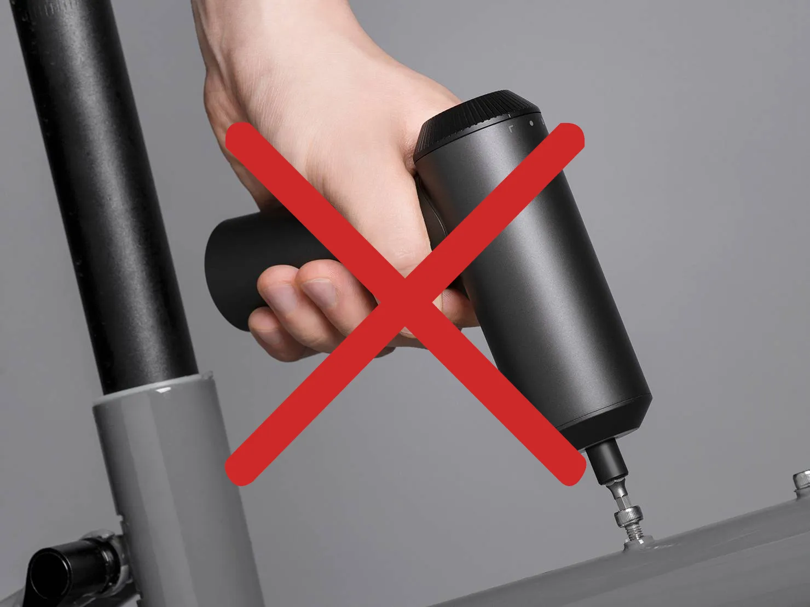{.img1}
    Please install the corner brackets as shown in the diagram：
    {.img1}
    {.img1}

!!! info "info"
    Screws need to be coated with threadlocker:
    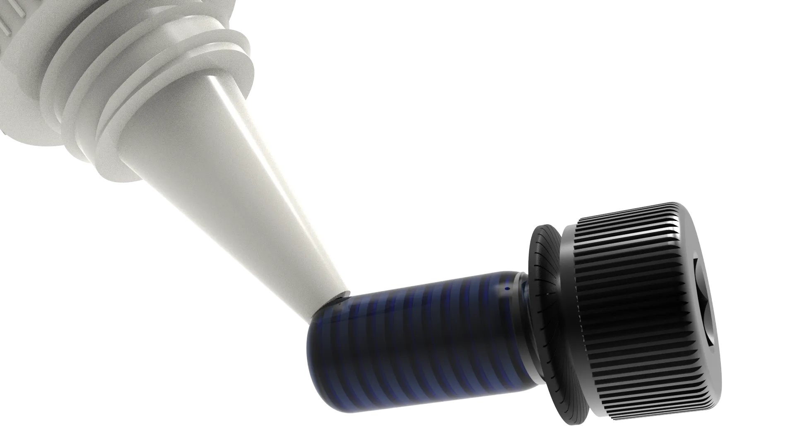{.img1}
    Notice <strong>M4 washer</strong> The installation requires the use of screws that require the application of thread-locking adhesive,highlighted in <strong>blue</strong>：
    {.img1}

???+ tip "tip"

    Please perform the assembly on a flat surface such as a tabletop or a non carpeted floor:
    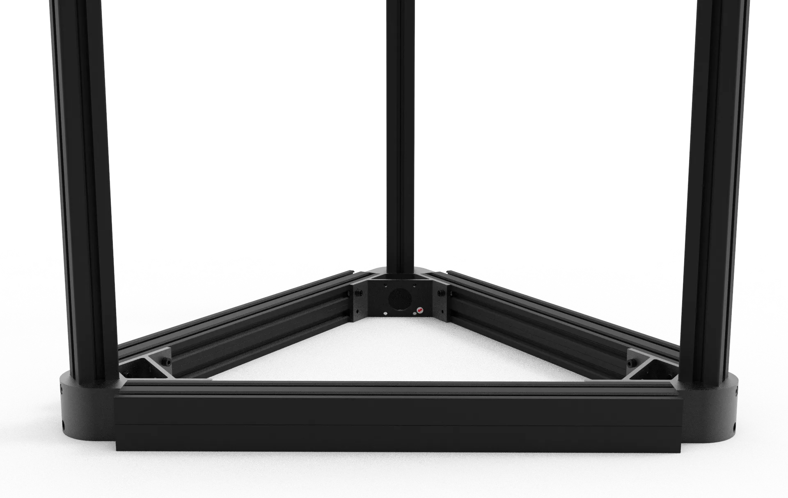{.img1}

## 1.Column assembly

### Required materials

1.Metal angle bracket * 6
   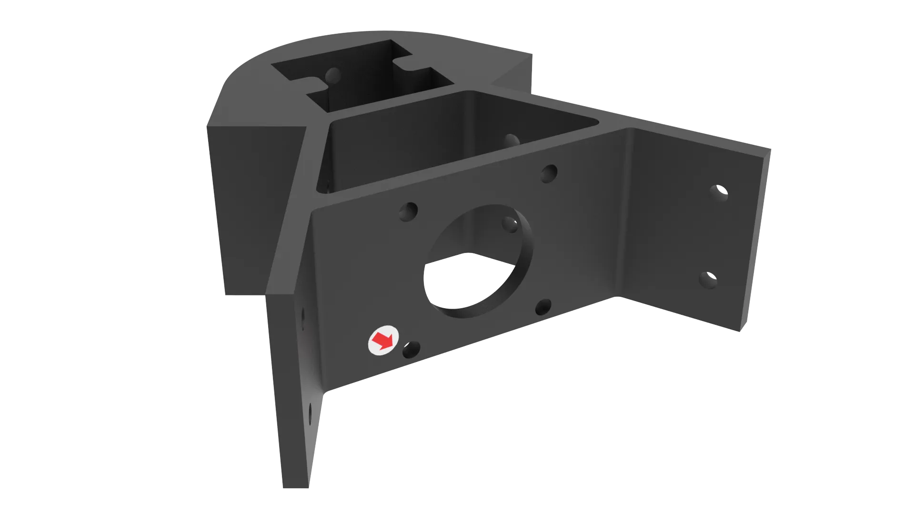{.img1}

2.Long aluminum profile * 3
   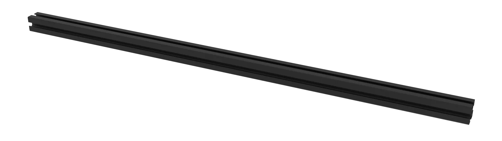{.img1}

3.M4 washers * 6
   {.img1}

4.M4*10 cap head screws * 6
   {.img1}

5.T-Nut type 30 - M4 * 6
   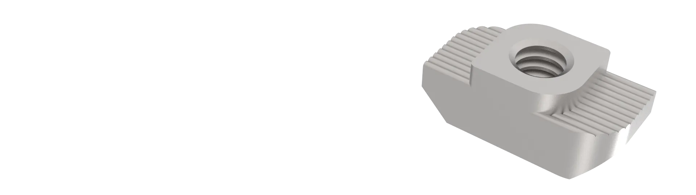{.img1}

### Assembly process

1.Insert the M4*10 cap head screws into the M4 washers and apply threadlocker adhesive, as shown in the picture (note the orientation of the M4 washers).
   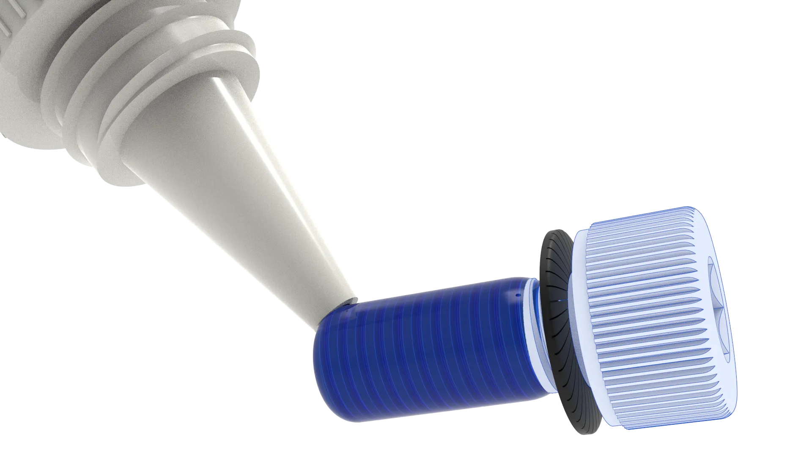{.img1}

2.Insert the metal corner brackets as shown in the picture.
   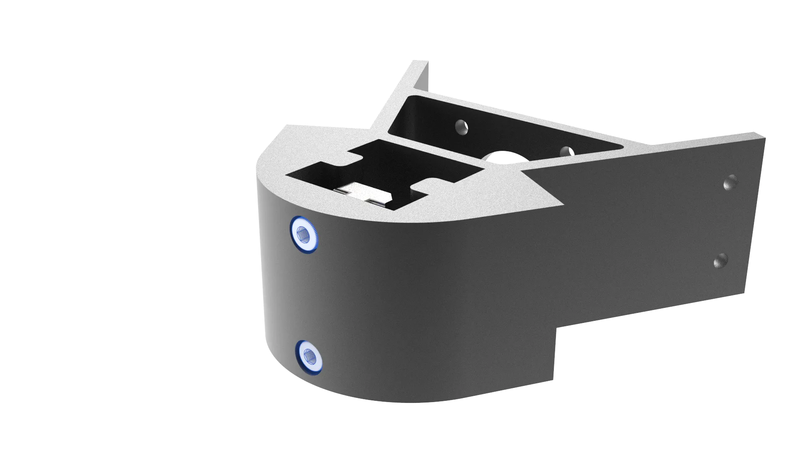{.img1}

3.Tighten the Type 30-M4 drop-in t-nut, but do not tighten it completely.
   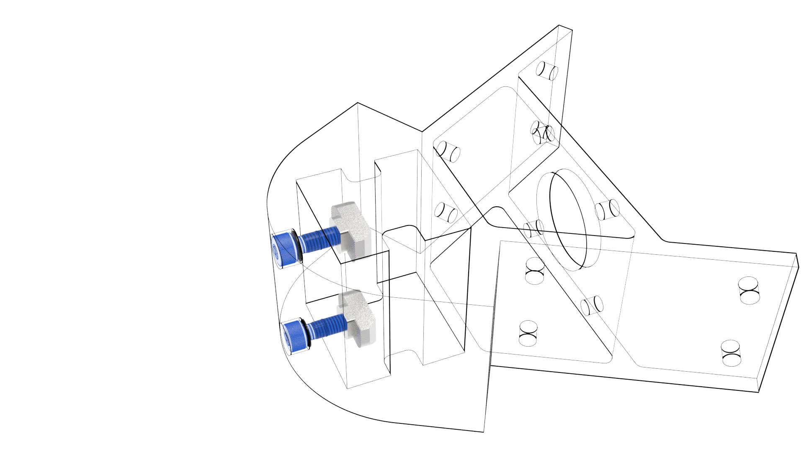{.img1}
   
4.Insert the long aluminum profile and tighten the two M4*10 cap head screws.
   {.img1}

!!! info "info"
    The long aluminum profile should be flush with the metal corner bracket and should not extend beyond it.

5.Fix the metal corner bracket to the other end using the same installation method. Note the position of the metal corner bracket; the distance between the two metal corner brackets should be <strong>750MM</strong>.
   {.img1}

6.The other two installation methods are the same.
   {.img1}
   
## 2.Crossbeam Assembly

### Required Materials

1.Short aluminum profile * 6
   {.img1}

2.M4 washers * 12
   {.img1}

3.M4*10 cap head screws * 12
   {.img1}

4.T-Nut type 20 - M4 * 12
   {.img1}

### Assembly Process

1.When assembling the crossbeam, to ensure the short profiles are parallel, it is recommended to assemble on a flat table or ground.
   {.img1}

2.Insert the M4*10 cap head screw into the M4 washer, apply threadlocker, as shown in the picture (note the orientation of the M4 washer).
   {.img1}

3.Insert the metal angle bracket and screw on the T-nut 20-M4. Do not tighten it completely, just tighten it, as shown in the picture.
   {.img1}

4.For ease of installation, place the two short aluminum profiles as shown in the diagram.
   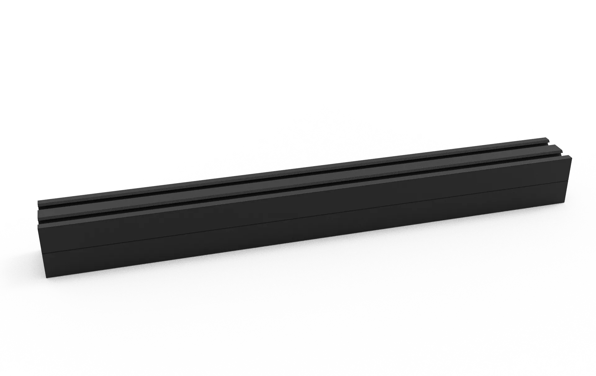{.img1}
   
5.Push the short aluminum profiles into the slots of the upper short aluminum profile, as shown in the diagram.
   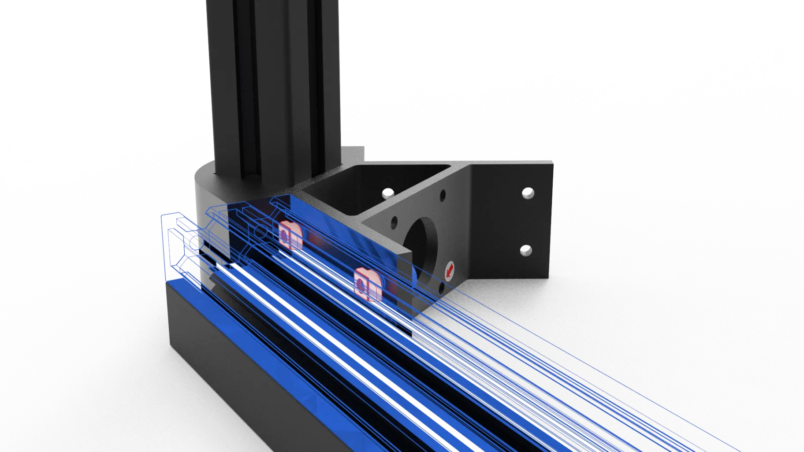{.img1}

6.At this point, the smooth side of the short aluminum profiles should face outwards.
   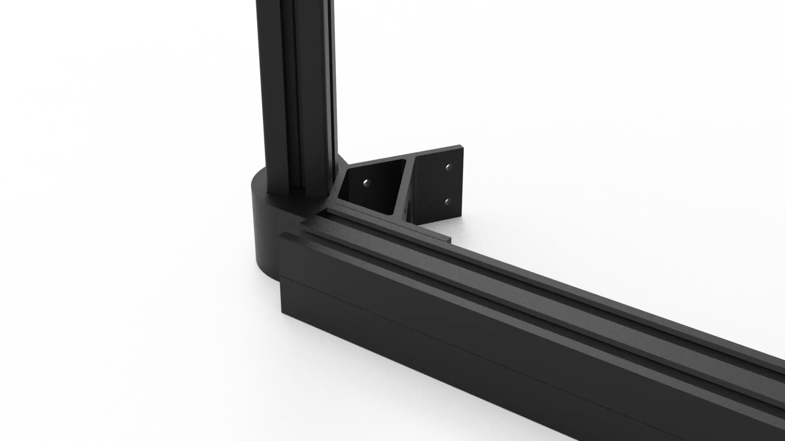{.img1}

7.After clamping and adjusting, first tighten the M4*10 cap head screw on the inside of the corner piece. 
   {.img1}

!!! info "info"
    Try sliding it to ensure it is tightened completely. After tightening, the short aluminum profile will not loosen or slip off.

8.After ensuring it is tightened completely, tighten the other M4*10 cap head screw to ensure it is securely and firmly fixed.
   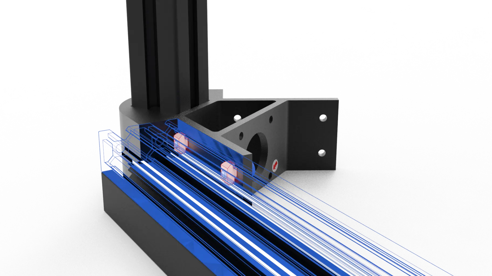{.img1}

9.The correct installation of the 20-type M4 T-nut should be as shown in the figure.
    {.img1}

10.The installation method on the other side is the same, as shown in the figure.
    {.img1}

11.Note that all the blue M4*10 cap head screws need to be fitted with M4 washers and have thread-locking adhesive applied. The bottom installation is shown in the picture.
    {.img1}

12.The top installation method is the same. The short profile is fixed below the metal corner bracket, as 
shown in the picture.
    {.img1}

13.Finally, check all screws one by one and tighten them again to ensure that all screws on the entire frame are tightened and have a certain rigidity. The installation is shown in the picture.
    {.img1}
  
## 3.Motor Assembly

### Required Materials

1.Stepper Motor * 6
   {.img1}

2.Shock Absorbing Pads * 6
   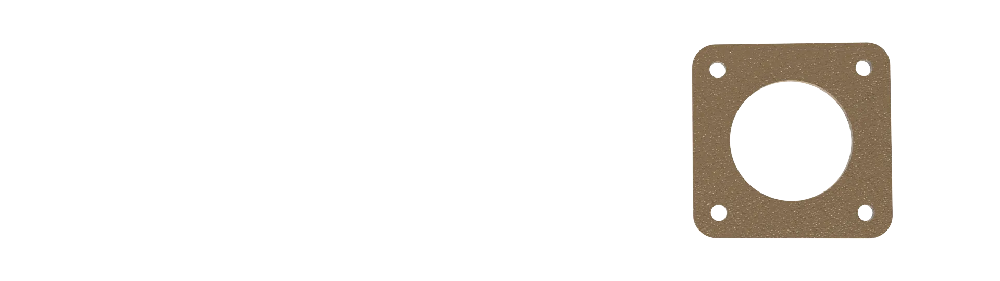{.img1}

3.M3*10 cap Head Screws * 12
   {.img1}

### Assembly Process

1.Place the stepper motor as shown in the figure and cover it with shock absorbing pads, as shown in the figure. 
   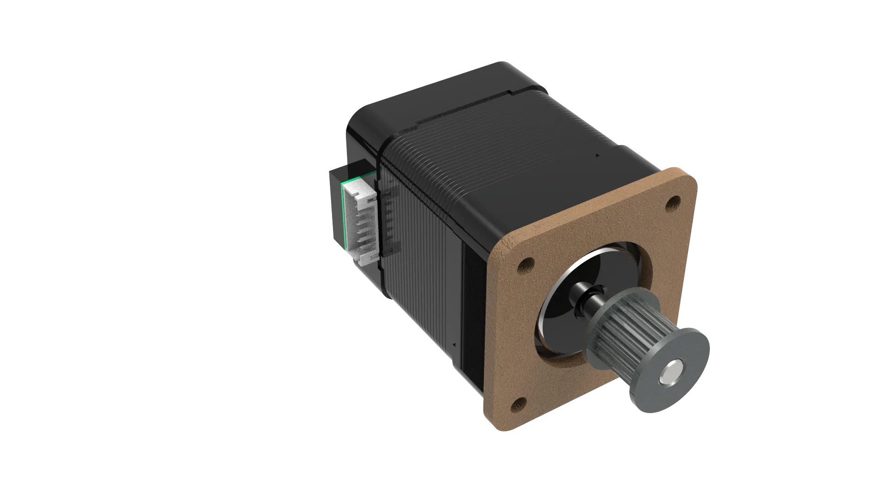{.img1}

2.Pass the four M3*10 cap-head screws through the metal corner bracket and the shock-absorbing pad to fix them to the stepper motor, as shown in the figure.
   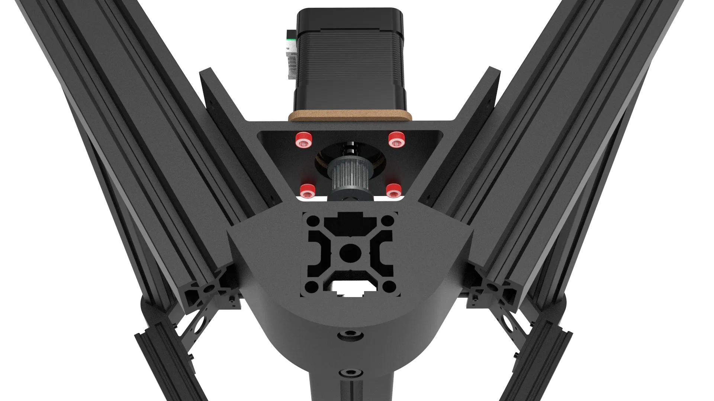{.img1}
   
3.If installed correctly, the stepper motor will be slightly higher than the metal corner bracket. Please note the direction of the stepper motor wires. No need to tighten; just ensure there is no gap between the stepper motor and the shock-absorbing pad, as shown in the figure.
   {.img1}

4.The installation method for the other two groups is the same, as shown in the figure.
   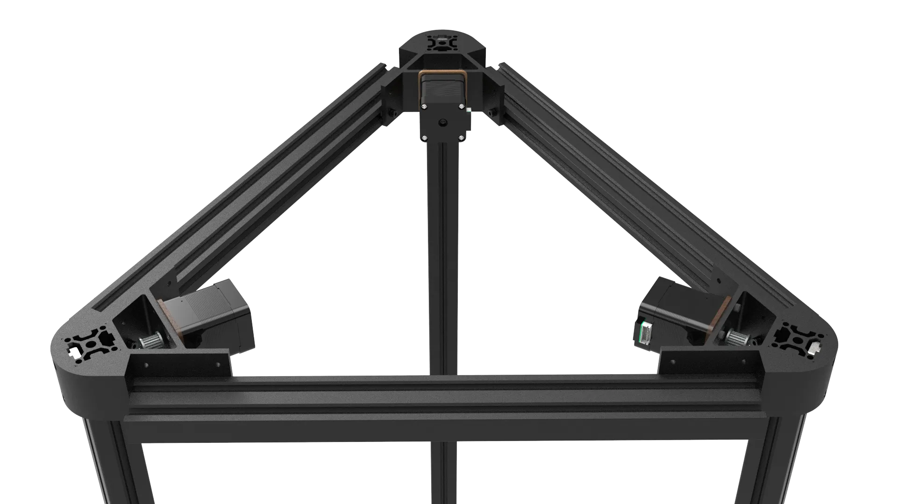{.img1}

5.Reverse the frame to install the following three groups, using the same method, as shown in the figure.
   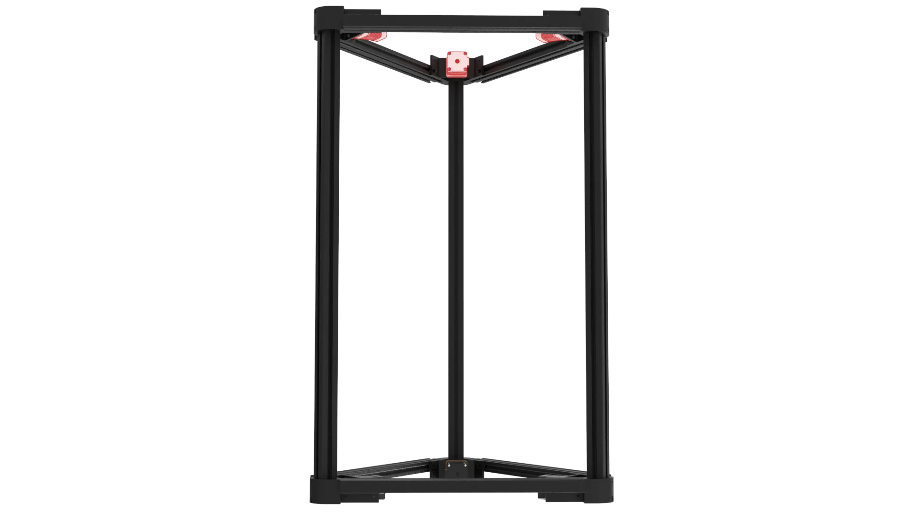{.img1}

!!! warning "warning"
    In order to ensure the rigidity of the entire printing frame, it is recommended to let it stand for 24 hours after gluing before printing to ensure that the thread glue is completely solidified.

???- faq "FAQ"

    **Q: Why do I need to add spacers to fix corner parts?**

    **A:** Metal corner parts plus metal screws and nuts are very easy to loosen in high-speed and high-frequency vibration scenarios, resulting in screw loosening and falling off, and the main purpose of increasing the gasket is to prevent loosening, anti-rebound, and anti-loosening clearance.

    **Q: Why are gaskets positive and negative?**

    **A:** The use of disc spring plus double-sided tooth anti-slip washer is mainly for the application scenario of metal to metal locking, vibration, heat, and loosening, there are tooth patterns on both the upper and lower sides once tightened, the teeth will be slightly embedded in the metal, any vibration can not be turned The nut plus itself is a tapered disc spring structure, there is a preload force, in the parts are heated and expanded, cooling and contracted, the contact surface is slightly crushed, wear, long-term vibration leads to the gap, can continue to maintain the pressing force, after locking almost never loosened, Please pay special attention to the installation direction of the gasket when installing, incorrect installation will lead to incorrect elasticity, small preload and instability, when the screw is loosened and needs to be reinstalled, it is recommended to replace the gasket.

    **Q: Why do screws need to be threaded?**

    **A:** The purpose of gluing is to rely on chemical curing, "stick" the thread, there is a lubricating effect when tightening, the torque is more stable, it does not bite to death at high temperature, fills the thread gap, is moisture-proof, anti-oxidation, anti-rust, has slight elasticity, can keep the locking force not attenuated, it is recommended to use Loctite's 243 thread adhesive, medium strength 7N, can be disassembled.

    **Q: Can I use other glue?**

    **A:** If you don't consider disassembly, you can use Loctite's 270 or 271 high-strength red glue, if you forget to glue when screwing, unlike disassembly, you can use penetrating green glue for reinforcement.

    **Q: Why choose boat type nuts?**

    **A:** There are many ways to fix, the reason for not choosing punching or tapping fixing is mainly considering cost and scalability, the cost of punching is high and the cutting accuracy is not easy to guarantee, the reuse rate of the profile is low in the later stage, the use of ship nuts is low cost and easy to disassemble and assemble, the choice of non-removable square nuts will cause the problem of not being easy to disassemble and assemble, choose stainless steel spring nuts with higher costs, there is no practical meaning, to ensure the rigidity of the fuselage is to add glue to the gasket instead of the screw itself, High-strength screws are chosen to ensure removability.

    **Q: What is the use of reserved holes on corner pieces?**

    **A:** Because it is an all-metal structure, the use of unilateral fixation can meet the strength requirements, and a set of common European standard 2020, 1515, 1020 aluminum profiles can be installed in the same way with the reserved holes, which will not affect any printed parts, and can increase its own strength and rigidity.

    **Q: What are the advantages of this framework?**

    **A:** The frame installed using the installation method in this tutorial has the rigidity and stability of the frame, and the column profile is strengthened from 2020 aluminum profile to 3030 aluminum profile to further improve its rigidity, and six motors can be installed. The corner parts can increase the profile again to improve its own rigidity, no need to punch and tap, low requirements for profile processing (it is necessary to ensure the consistency of the cutting size of the beam profile), low cost, strong expandability, increase or decrease the length of the beam to change the printing size, increase or decrease the length of the column to change the printing height, simple assembly, the three sides are the same, the triangular stability is better than the square, and the assembly requirements are low.